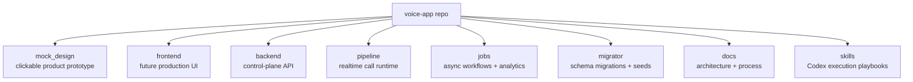
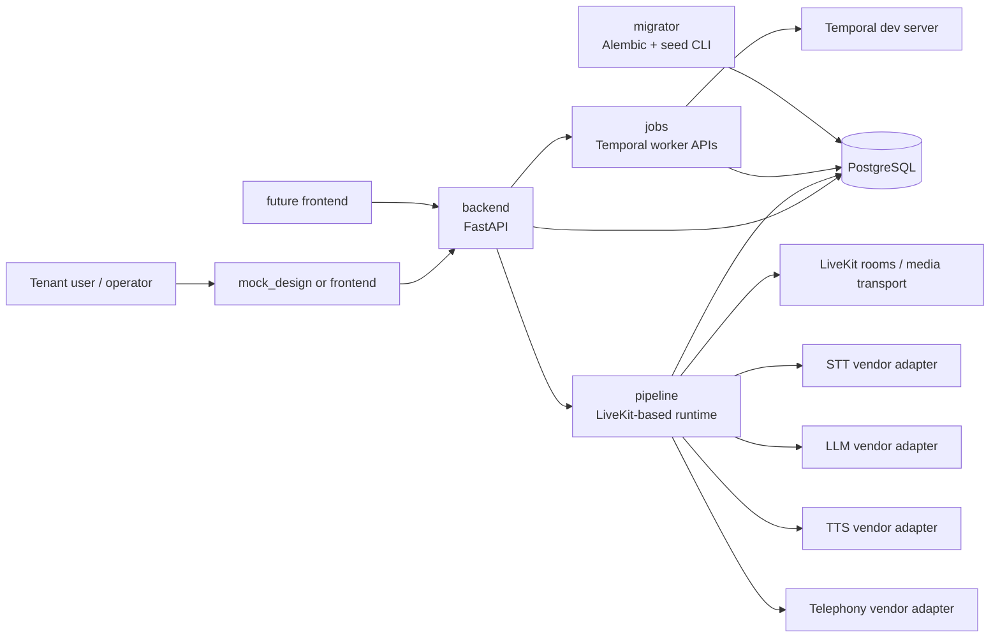
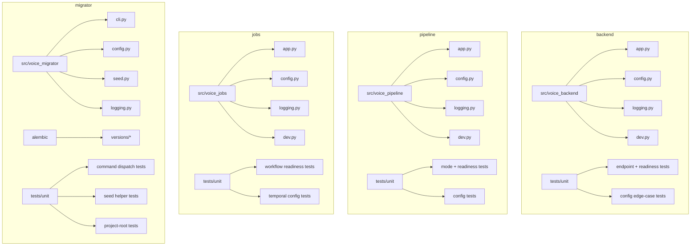

# Voice Code Architecture Diagram

This document describes the initial code architecture for the Voice app starter.
It is intentionally shaped for local-first development, mock-first product iteration,
and clean separation between future production services.

## Top-Level Repo Structure

## Runtime Architecture

## Internal Package Structure

## Third-Party Tools And Frameworks

```mermaid
flowchart TB
    root["voice-app"]

    root --> next["Next.js + React + Tailwind<br/>UI layers"]
    root --> fastapi["FastAPI<br/>backend, pipeline, jobs HTTP shells"]
    root --> pydantic["Pydantic Settings<br/>typed local config"]
    root --> structlog["structlog<br/>consistent service logging"]
    root --> postgres["PostgreSQL<br/>core relational datastore"]
    root --> sqlalchemy["SQLAlchemy + Alembic<br/>schema + migration layer"]
    root --> uv["uv<br/>Python workspace + package runner"]
    root --> pytest["pytest<br/>unit test runner"]
    root --> ruff["Ruff<br/>lint + formatting"]
    root --> temporal["Temporal<br/>async workflow engine"]
    root --> livekit["LiveKit Agents<br/>realtime voice runtime foundation"]
    root --> docker["Docker Compose<br/>local Postgres/Adminer bootstrap"]
```

## Design Intent

- `mock_design` remains the stakeholder-facing, high-fidelity demo surface.
- `frontend` stays available for future production implementation without contaminating the mock.
- `backend` owns tenant, workspace, agent, connection, and operational state.
- `pipeline` owns media/session orchestration and future vendor adapter composition.
- `jobs` owns post-call processing, sync, and analytics workflows.
- `migrator` is the only package allowed to mutate schema shape directly.
- Each Python package owns its own unit test layer so coverage can grow with the service boundary.
