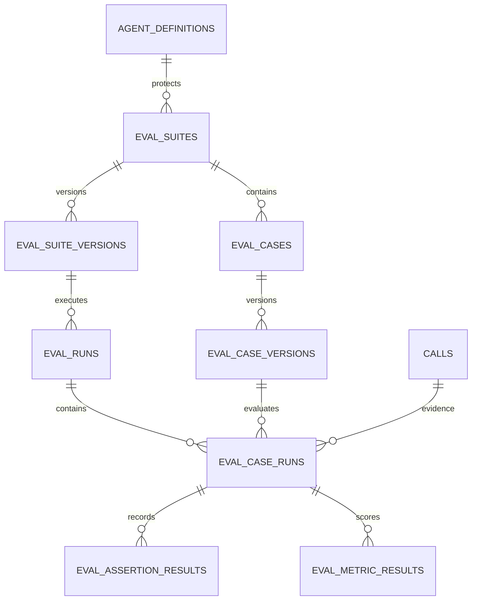

# Evaluation System

## Purpose

Evaluations provide repeatable confidence checks for any saved Voice agent workflow. A suite is
workspace-scoped and contains versioned cases. A run snapshots the agent version, scenario
definition, assertions, rubric, execution mode, and repeat policy so a result remains explainable
after the agent changes.

## Execution modes

The domain reserves four execution modes:

- `scripted_text`: deterministic caller and response trace for fast local checks.
- `simulated_text`: an LLM-driven caller for multi-turn behavior exploration.
- `scripted_audio`: fixed caller audio through a real LiveKit room.
- `simulated_audio`: an LLM-driven caller participant that listens and speaks through LiveKit.

The enabled provider-backed mode is `live_audio`. Each case creates an isolated LiveKit room and
dispatches two real workers: the published production agent (`voice-router-agent`) and the
evaluation caller (`voice-eval-caller`). Both use the same Deepgram STT, OpenAI LLM, Cartesia TTS,
Silero VAD, turn handling, and agent workflow configuration. The caller is an LLM-driven farmer
that speaks through the same audio path as a human participant, listens to the production agent,
and reports normalized transcript, transitions, and completion evidence to the backend. The
production agent and caller are both included in RoomIO subscriptions, including LiveKit AGENT
participants, so audio is bidirectional rather than synthetic text.

`scripted_text` remains available for fast deterministic storage, assertion, and scoring checks. It
must not be described as a voice-call confidence result. Provider-backed cases have a hard
120-second case timeout and an eight-production-turn watchdog. A watchdog result is persisted with
`caller_turn_limit` evidence and cannot silently pass as a completed call.

## Persistence model

`eval_case_runs.call_id` links evaluation evidence to the normal call, transcript, event, tool,
guardrail, and metric history. Evaluation calls are marked as test traffic and carry
`resolved_config.source = eval`; production reports must exclude them by default.

## Evaluation flow

1. The backend validates workspace access and creates a suite against the latest agent version.
2. Suite and case definitions receive immutable versions.
3. A run selects a suite version, case versions, execution mode, and repeat policy.
4. `live_audio` creates a room, dispatches the production agent, dispatches the evaluator caller,
   and waits for the caller's internal evidence callback. Room cleanup is attempted after every
   case, including timeout and worker failure.
5. The backend normalizes the caller evidence into a conversation trace and links it to a test
   `Call` record with `is_test = true`.
6. Objective assertion strategies evaluate the trace.
7. Metric strategies score quality and retain judge metadata and explanations.
8. The run stores pass/fail totals, score, and links to every call trace.

For local development, the evaluator caller captures both the local evaluator track and the
subscribed LiveKit agent track, mixes them into one mono WAV artifact, and stores it under
`VOICE_RECORDINGS_DIR`. The authenticated call-recording endpoint serves that artifact to the
evaluation run evidence viewer; older runs without an artifact show recording unavailable rather
than synthetic audio.

Behavior failures are never retried. Only classified infrastructure failures may be retried, with
bounded attempts and a visible reason. Until the jobs executor is connected, an evaluation run is
bounded by the API request and should be limited to the enabled deterministic mode.

## Assertion and scoring rules

Objective assertions include text, regex, outcome, state transition, tool call, variable,
guardrail, and turn-limit checks. Empty text assertions and cases without assertions or metrics
fail closed. Critical assertion failures always fail the case. A case passes when its score is at
least 70%, every configured metric meets its threshold, and no critical assertion fails. These
thresholds are configuration in the domain and may become suite-level settings later.

The initial deterministic judge is intentionally explicit and marked in `judge_metadata`. A
semantic LLM judge must be introduced behind the same metric strategy interface and must retain
its model, prompt version, and evidence references.

## Local-first policy

- Local scripted tests are the default development feedback loop.
- No evaluator may require a paid service to validate schemas, assertions, scoring, or orchestration.
- Provider-backed audio evaluation is opt-in and uses tenant-configured connections for both the
  production agent and the evaluator caller.
- Raw audio and transcripts must use the existing artifact and retention policies when those are
  introduced; secrets never belong in suite, case, or run snapshots.

## Quality gates

- The current unit suite covers suite/case versioning, deterministic assertion scoring, critical
  failures, weighted thresholds, unsupported-mode rejection, call linkage, and API serialization.
- Provider-backed execution requires unit coverage for the caller watchdog, callback validation,
  malformed caller input, repeat/fail-fast behavior, tenant/workspace isolation, cancellation,
  timeout cleanup, and failure finalization.
- Integration tests must cover migrations, API authorization, call linkage, and result persistence.
- Browser E2E tests must cover create suite, add case, run suite, inspect results, and open linked
  call evidence after the frontend and backend integration harness is enabled.
- A release gate must fail closed for missing critical assertions, guardrail violations, or a score
  below the configured threshold.
